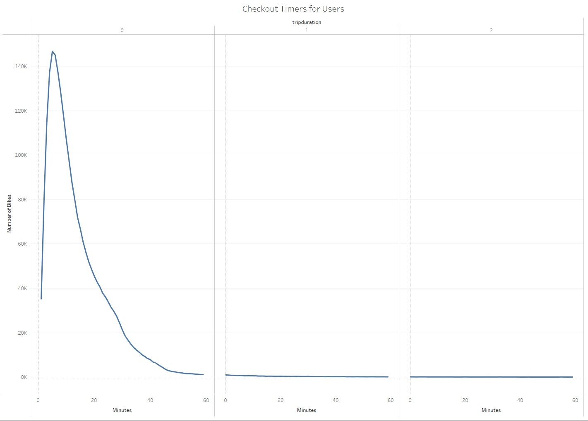
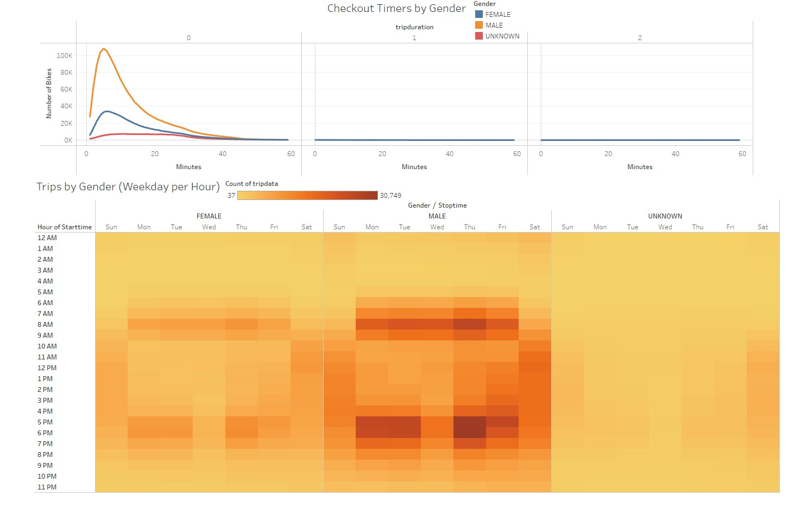
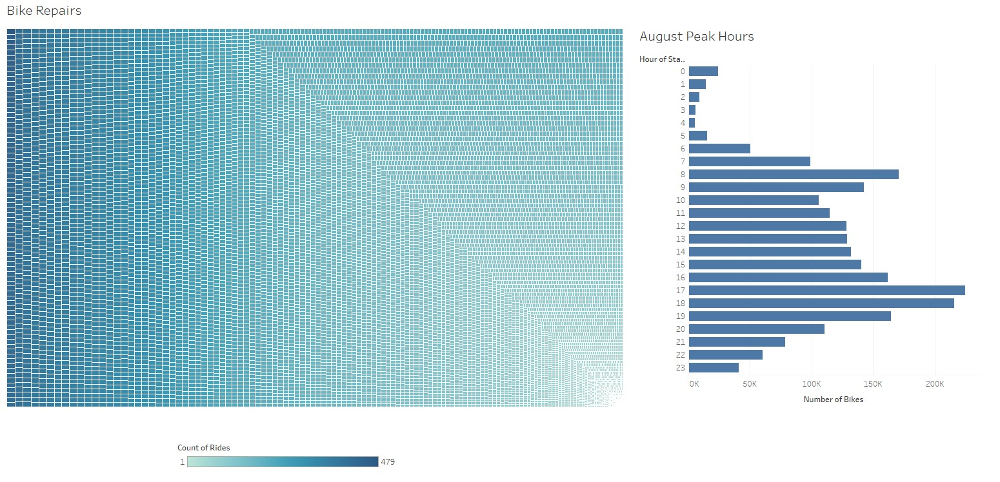
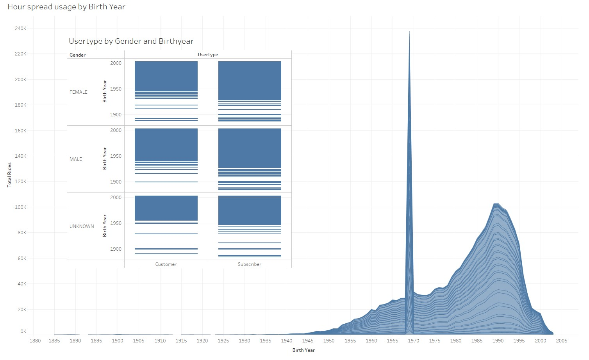

# Bikesharing

---

## Overview

- Import data into Tableau.
- Create and style worksheets, dashboards, and stories in Tableau.
- Use Tableau worksheets to display data in a professional way.
- Portray data accurately using Tableau dashboards.

---

## Results
Storyboard for results can be seen here:
[link to dashboard](https://public.tableau.com/app/profile/morgan.peterson/viz/NYCCitibikeanalysis_16374548692750/NYCCitibikeanalysis?publish=yes "link to dashboard").

In our analysis we notice at a high level that a majority of rides between all users a majority of use is within 1 hour of time.

In our next set of data we can see that a majority of our users are Males.

Moving on we have usage peak hours paired with the use each bike has had by bike id. This gives us insight as to what bikes need repairs and the best time to repair them.

---

## Summary

All in all most of our users tend to be males with ride time averages around 20-30 minutes. Additionaly we noticed that peak times to collect bikes for repairs are between 1-5am.

I wanted to find correlation between usage and age, so we added a chart that shows birthyear by usertype (organized by gender), and a filled graph that shows gaps of usage based on the birthyear. This gave us the following image and we can see that there was a spike for 1969 suggesting either wrong information or some event that triggered this. We also can tell that on average most users are under 30 years old. 

